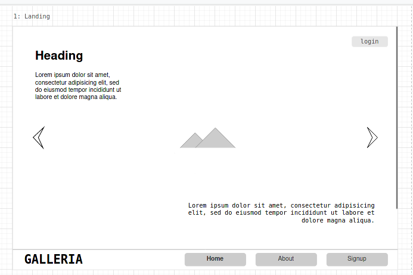
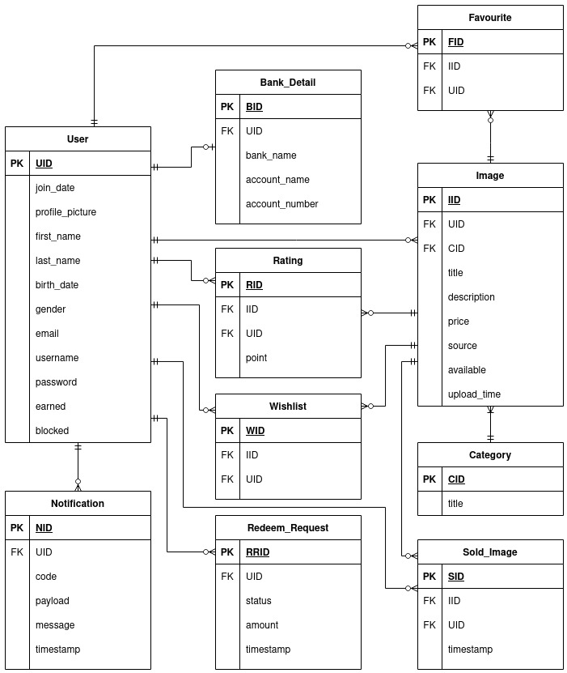

# Galleria : Online Image Gallery
#### Galleria is an online image sharing or selling platform.
Note: This is an academic project

Check [Setup Guide](Setup.md) to Run this Project

Check [User Types](#type-of-users)

### Features List-out:
* **Must-Have** Functionalities: `included`
    * User can signup and login
    * User can upload images
    * User can specify price for image or mark as free
    * User can browse images including ones from other users
    * User can search or filter images
    * User can download free or pay to download images
    * User can review & update their profile
    * User can mark images as favourite and rate the downloaded images
    * User can view average rating on posts
    * User can check and redeem earnings
    * User can update image details or remove 
    * User can delete their account

* **Should-Have** Functionalities: `included-except`
    * System adds watermark on unpaid images for sale and removes once paid
    * User gets notified on different activities
    * User can review transaction statement
    * User can report on undesired or potential images `not-included`
    * Images can be categorized
    * Super admin dashboard for project owner, for analytical reviews
    * Super admin user can review potential reports and block or charge users `not-included`
    * Super admin user can accept or decline redeemed/claimed earnings

* **Could-Have** Functionalities: `not-included-except`
    * User can comment on images
    * User can reset a forgotten password
    * User can check - view, like, ratings counts on image `included`
    * User can add hashtags on images and search-through
    * User can check their activity history
    * Integration of e-payment services(like. Esewa) to allow online transactions for real
    * Implementation of Censorship service to block or remove illegal image
    * Implementation of AI for generating advanced analytical reports
    * Implementation of ads for monetization
    * Better mechanism for inspecting copyrighted images

### Designing
##### Mockup

[View All](assets/OIG.drawio) (Hints: Open with [Diagrams.net](https://app.diagrams.net/?src=about))

 

#### Database
##### ER-Diagram

 

##### Database Entities
| SN   | Entity name    |
|------|----------------|
| 1    | User           |
| 2    | BankDetail     |
| 3    | Category       |
| 4    | Image          |
| 5    | Rating         |
| 6    | Favourite      |
| 7    | Wishlist       |
| 8    | SoldImage      |
| 9    | RedeemRequest  |
| 10   | Notification   |

##### Database Views
| SN   | View name              |    
|------|------------------------|
| 1    | users                  |
| 2    | images                 |
| 3    | wishes                 |
| 4    | highly_rated_images    |
| 5    | mostly_liked_images    |
| 6    | mostly_sold_images     |
| 8    | most_expensive_images  |
| 9    | top_earning_accounts   |
| 10   | top_rated_accounts     |
| 11   | app_status             |

##### Database Triggers
| SN    | Entity        | Trigger                                       | Call Procedure                    | Description
|-------|---------------|-----------------------------------------------|-----------------------------------|------------------------
| 1     | Favourite     | like_notification_trigger  `after insert`  | create_liked_notification         | creates notification when user marks image as favourite
| 2     | Rating        | image_rated_trigger  `after insert`        | image_rated_notification          | creates notification on image rated by viewer
| 3     | RedeemRequest | check_redeem_amount  `before insert`       | -                                 | validates redeem amount and creates exception to block insertion  if unacceptable (ex. amount < 5 or amount > earnings)
| 4     | RedeemRequest | redeem_request_made  `after insert`        | redeem_inqueue_notification       | creates notification about redemption request added to queue 
| 5     | RedeemRequest | check_redemption_status  `after update`    | handle_redemption_success         | updates earnings(cash on account) if redemption succeed, earnings -= redeem_amount
|       |               |                                               | redeem_success_notification       | creates notification about successful redemption   `payment made into bank_account`
|       |               |                                               | redeem_inqueue_notification       | creates notification about redemption request added to queue
|       |               |                                               | redeem_rejected_notification      | creates notification about redemption request rejected
|       |               |                                               | redeem_req_accepted_notification  | creates notification on redemption request accepted  `payments not made yet`
| 6     | SoldImage     | sold_notification  `after insert`          | create_sales_notification         | creates notification on purchase successful
| 7     | SoldImage     | update_earnings  `after insert`            | update_earnings                   | updates earnings on successful purchase, earnings += image_price

 

#### Type of Users:
* General User  : could be anyone who uses the service 
    * They can perform all the activities listed above except of super-admin
    * They can upload image, can search images, can buy images, can check personal dashboard
    * [view all functionalities](#features-list-out)
    * User account Information of General User are all stored in Database. In User Entity. [View ER Diagram](#database) 
    * Homepage: `http://localhost:8080/web_war_exploded/galleria.oh`
    
* Administrator
    * They can check App Status. like trending images, top earning accounts, etc.
    * They can perform other administrative tasks. like block user account, ...
    * This user account should be created from Admin Console of GlassFish server with role `admin`.
    * GlassFish Admin Console : `http://localhost:4848/`
    * Admin Homepage: `http://localhost:8080/web_war_exploded/galleria.admin`

Check [Setup Guide](Setup.md) to Run this Project